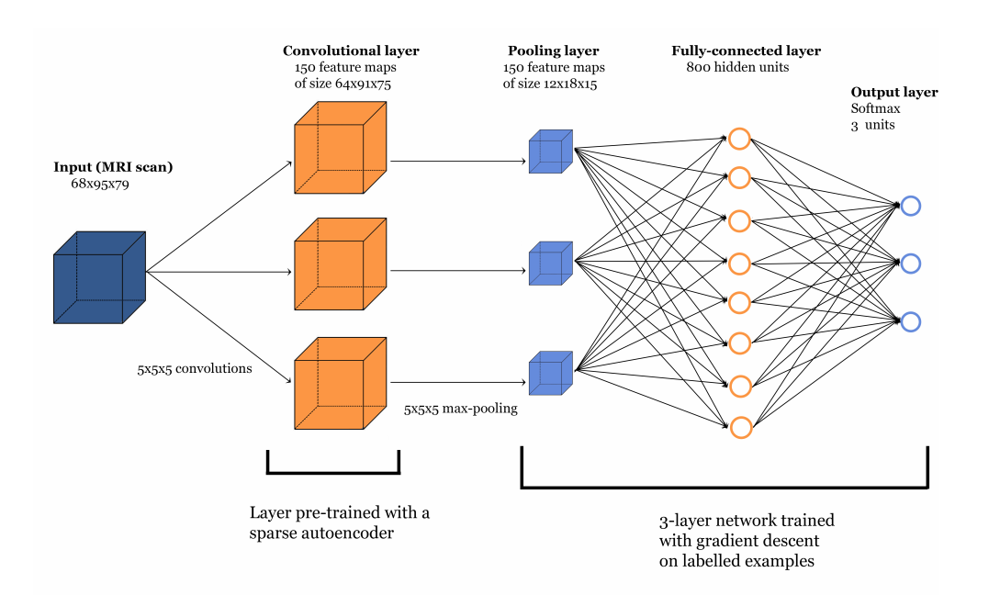

# Autoencoder Neural Network
Based on the paper [Predicting Alzheimer’s disease: a neuroimaging study with
3D convolutional neural networks](https://arxiv.org/pdf/1502.02506.pdf)

The model has two parts: an autoencoder and a 3D convolutional fully connected layer. The autoencoder trains on 5 x 5 x 5 patches randomly selected from the 3D MRI image. It unrolls the data into a 125 unit vector and uses it as input to the network which encodes a representation into a 150 unit vector before decoding the data into a 125 unit vector which can be reshaped back into the original image.

The weight connections from the input to the encoded layer are reshaped from a 125 x 150 weight matrix into a 150 x 5 x 5 x 5 3d convolution filters. The fully connected network uses a maxpool to downsample the data, a 800 unit dense layer and finally a 3 unit output layer.

Architecture of neural network from paper https://arxiv.org/pdf/1502.02506.pdf
